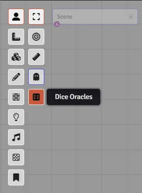
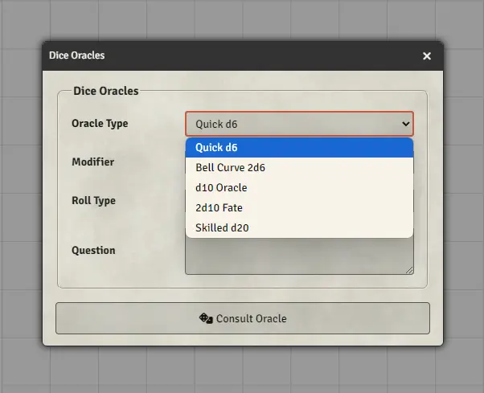
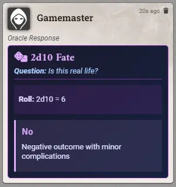
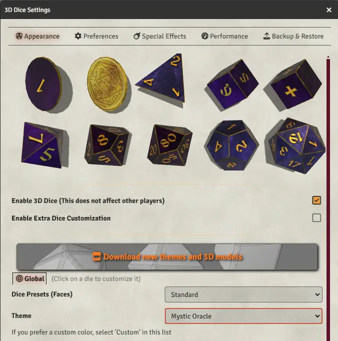

# FoundryVTT Dice Oracles

   

Roll dice to answer simple questions. Ask the oracles, the die doesn't lie!

## Module Settings

By default the Dice Oracles are available only to the GM, you can enable it to all players in the module settings.

## How to

1. Press the Dice Oracles button or press the letter "o" on your keyboard
{: width="300" .center-image}

2. Choose one of the five available Oracles (they have different probability distribution curves)
{: width="400" .center-image}

3. Get the Result
{: width="400" .center-image}

4. **Parameters:**
   1. *Modifier*: add positive or negative numbers to modify the roll result.
   2. *Roll Type*: the selected oracle can be rolled with advantage (roll twice the number of dice and keep the highest result) or disadvantage (roll twice the number of dices and keep the lowest result)
   3. *Question*: An optional question to be displayed in the chat card result

5. **Dice So Nice 3D Dice theme**
{: width="400" .center-image}
